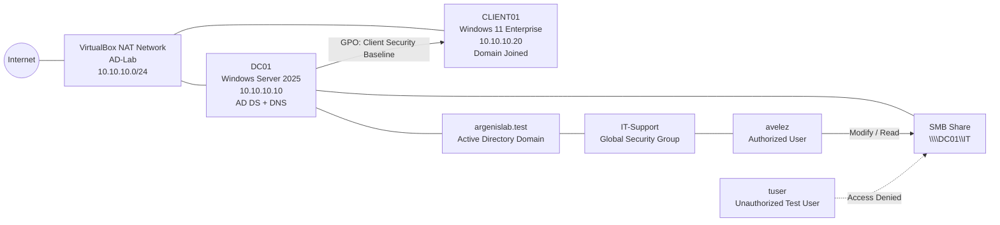
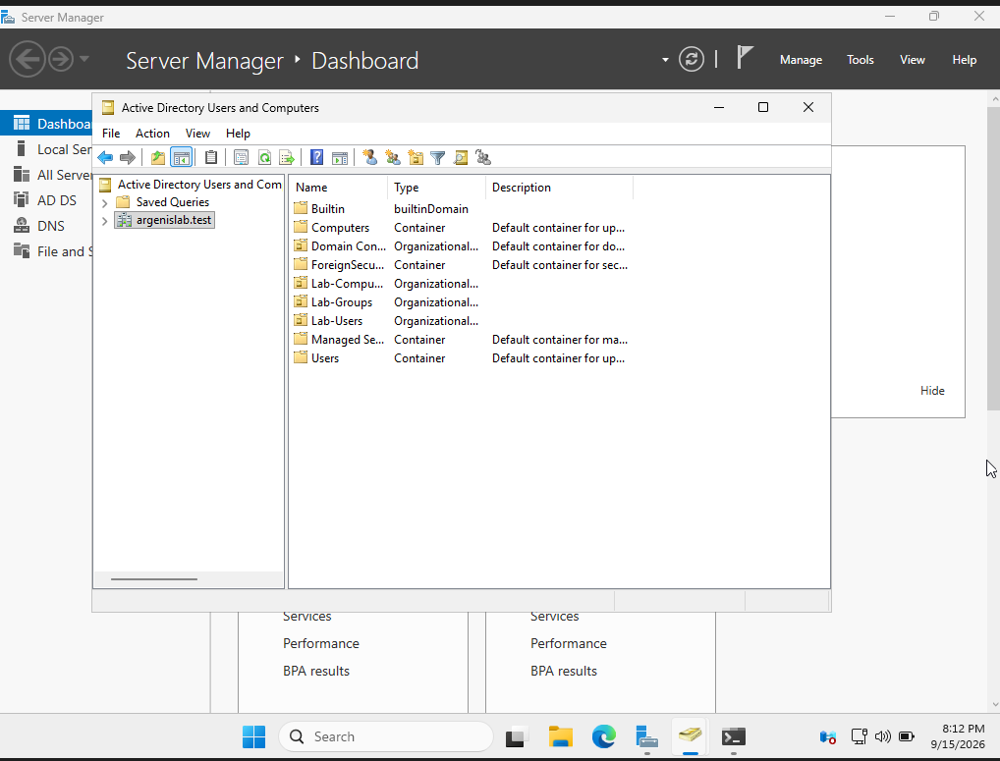
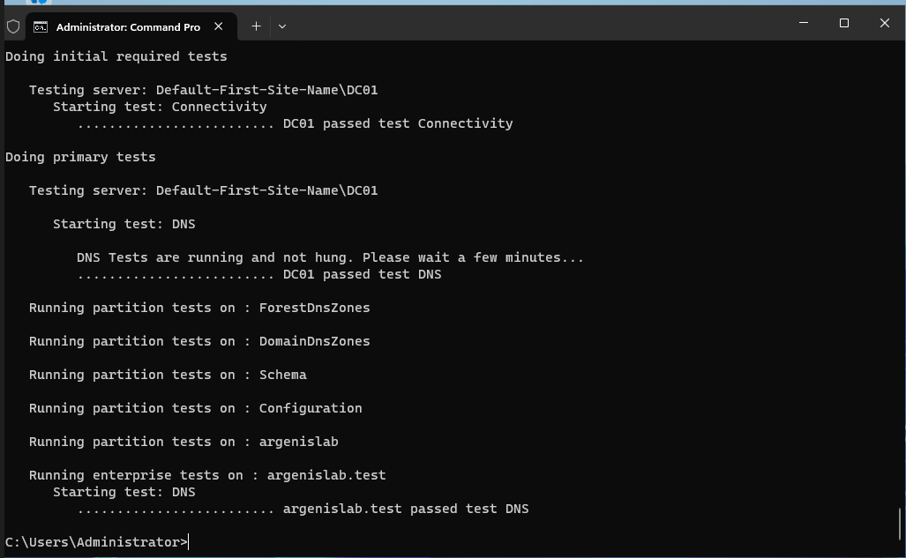
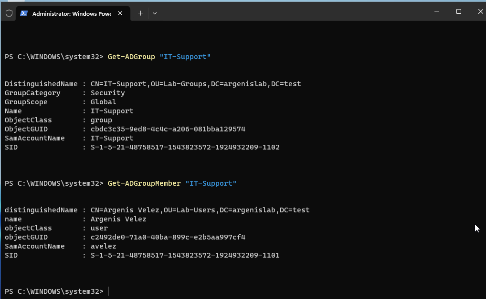
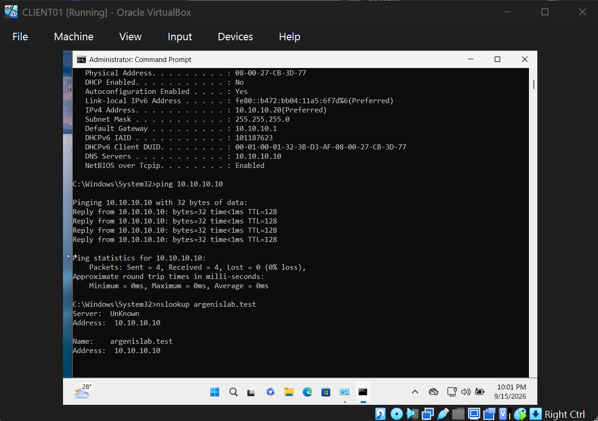
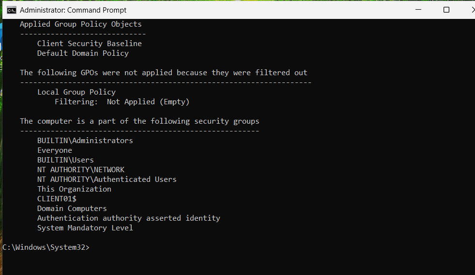
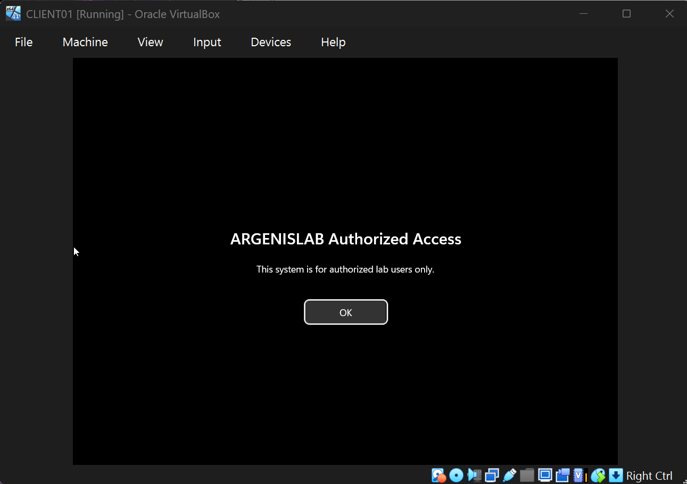
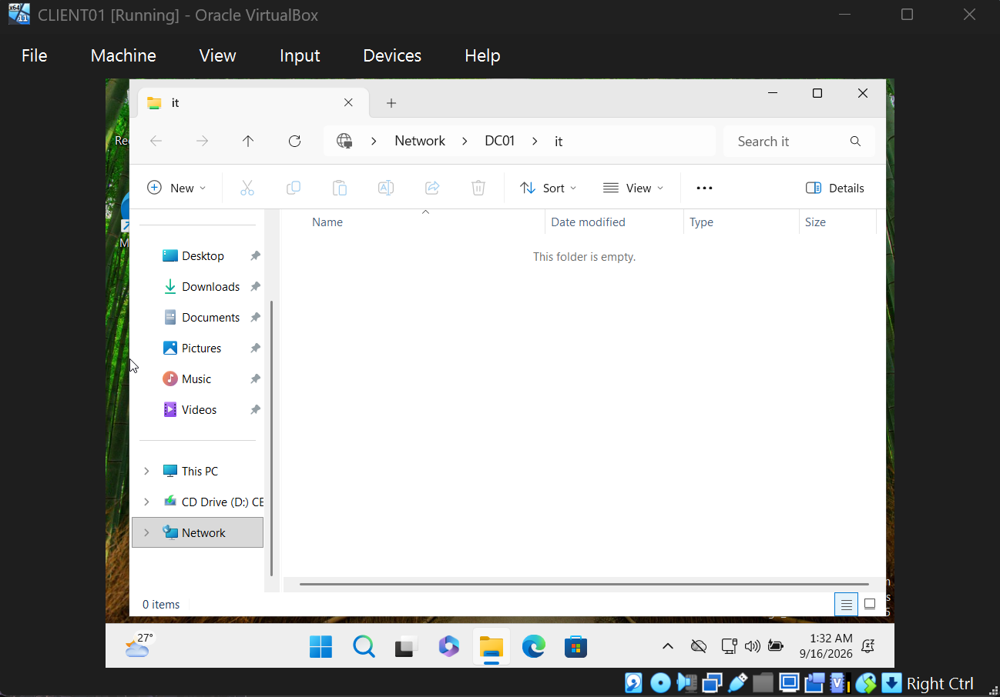
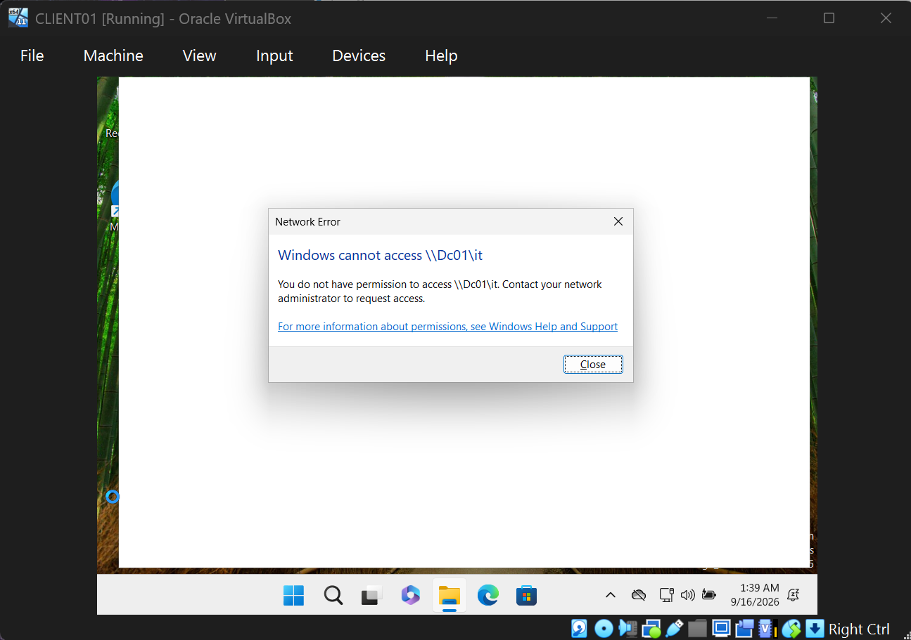

# Windows Active Directory Home Lab

A hands-on Windows infrastructure lab built with **Oracle VirtualBox**, **Windows Server 2025**, and **Windows 11 Enterprise**. The project demonstrates core system administration skills including Active Directory Domain Services, DNS, domain joining, Group Policy, PowerShell administration, SMB file sharing, NTFS permissions, and group-based access control.

## Lab Goals

- Deploy a Windows Server domain controller
- Configure a private virtual network with static addressing
- Create and manage an Active Directory forest/domain
- Organize users, computers, and groups with OUs
- Join a Windows 11 client to the domain
- Apply domain Group Policy to the client
- Create an SMB file share secured with NTFS and share permissions
- Validate authorized and unauthorized access
- Troubleshoot DNS, Group Policy, and network configuration issues

## Architecture



## Environment

| Component | Configuration |
|---|---|
| Hypervisor | Oracle VirtualBox |
| Domain Controller | DC01 |
| Server OS | Windows Server 2025 Standard Evaluation |
| Client | CLIENT01 |
| Client OS | Windows 11 Enterprise Evaluation |
| Domain | `argenislab.test` |
| NetBIOS domain | `ARGENISLAB` |
| Virtual network | `AD-Lab` NAT Network |
| Network | `10.10.10.0/24` |
| Gateway | `10.10.10.1` |
| DC01 | `10.10.10.10` |
| CLIENT01 | `10.10.10.20` |
| Client DNS | `10.10.10.10` |

## Active Directory Structure

```text
argenislab.test
├── Lab-Users
│   ├── avelez
│   └── tuser
├── Lab-Computers
│   └── CLIENT01
└── Lab-Groups
    └── IT-Support
```

`avelez` is a member of the `IT-Support` global security group. `tuser` is intentionally not a member and is used to validate access restrictions.

## Key Implementation Steps

### 1. Domain Controller

Configured `DC01` with the static network settings:

```text
IP Address:      10.10.10.10
Subnet Mask:     255.255.255.0
Default Gateway: 10.10.10.1
DNS Server:      10.10.10.10
```

Installed **Active Directory Domain Services** and **DNS**, then promoted the server as the first domain controller in a new forest:

```text
argenislab.test
```

### 2. Active Directory Objects

Created:

- `Lab-Users` OU
- `Lab-Computers` OU
- `Lab-Groups` OU
- `avelez` domain user
- `tuser` domain user
- `IT-Support` global security group

Added `avelez` to `IT-Support`.

### 3. Windows 11 Domain Client

Configured `CLIENT01`:

```text
IP Address:      10.10.10.20
Subnet Mask:     255.255.255.0
Default Gateway: 10.10.10.1
DNS Server:      10.10.10.10
```

Validated connectivity and DNS resolution, then joined:

```text
argenislab.test
```

Successfully authenticated as:

```text
ARGENISLAB\avelez
```

### 4. Group Policy

Created a GPO named:

```text
Client Security Baseline
```

Linked it to the `Lab-Computers` OU.

Configured an interactive logon banner:

```text
ARGENISLAB Authorized Access
This system is for authorized lab users only.
```

Validated policy application with:

```cmd
gpupdate /force
gpresult /scope computer /r
```

### 5. SMB Share and Access Control

Created:

```text
C:\Shares\IT
```

Published it as:

```text
\\DC01\IT
```

Configured group-based access:

- `IT-Support` — Modify / Read
- `Administrators` — Full Control
- Unauthorized domain users — No access

Validation:
- `ARGENISLAB\avelez` successfully opened and modified files in the share.
- `ARGENISLAB\tuser` received an access denied message.

## Validation Screenshots

### Active Directory OU Structure


### DNS Health


### PowerShell AD Validation


### Client Network and DNS Connectivity


### Group Policy Applied


### Group Policy Logon Banner


### Authorized SMB Access


### Unauthorized SMB Access Denied


## Skills Demonstrated

- Windows Server administration
- Active Directory Domain Services
- DNS configuration and troubleshooting
- Organizational Units
- User and group administration
- Windows domain joining
- Group Policy Management
- PowerShell administration
- TCP/IP and static addressing
- VirtualBox networking
- SMB file sharing
- NTFS permissions
- Role/group-based access control
- Least privilege
- Infrastructure troubleshooting
- Technical documentation

## Troubleshooting Highlights

This lab intentionally included real troubleshooting rather than only a clean setup path.

Examples:
- Corrected an incorrect `/8` subnet mask to `/24`
- Diagnosed a Windows client APIPA address (`169.254.x.x`) caused by missing static configuration
- Reconfigured the client IP using `netsh`
- Verified AD DNS SRV records with `nslookup`
- Used `dcdiag` to distinguish current DNS health from historical event-log warnings
- Fixed GPO scope by moving `CLIENT01` from the default `Computers` container into `Lab-Computers`
- Verified GPO application with `gpresult`
- Tested authorized and unauthorized SMB access

See [docs/TROUBLESHOOTING.md](docs/TROUBLESHOOTING.md) for details.

## Next Improvements

Possible future additions:

- DHCP Server role
- Additional Windows clients
- Separate departmental OUs and security groups
- Password and account lockout policies
- Windows Defender Firewall GPOs
- PowerShell user-provisioning scripts
- Centralized event logging
- Microsoft Entra ID / Azure integration
- Windows Server backup and restore testing
- Additional file shares using AGDLP-style permissions
