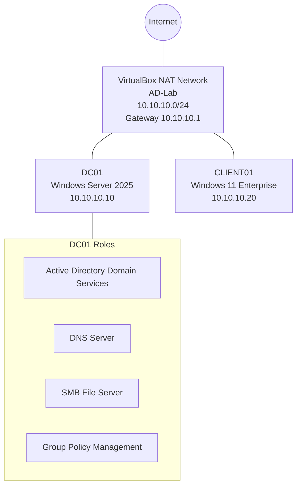

# Architecture Overview

## Logical Design

The lab uses one VirtualBox NAT Network named `AD-Lab` with the IPv4 network `10.10.10.0/24`.



## Identity Design

Domain:

```text
argenislab.test
```

NetBIOS:

```text
ARGENISLAB
```

Organizational Units:

```text
Lab-Users
Lab-Computers
Lab-Groups
```

Security relationship:

```text
avelez
  └── member of IT-Support
       └── granted Modify/Read access to \\DC01\IT

tuser
  └── not a member of IT-Support
       └── denied access to \\DC01\IT
```

## Group Policy Design

The GPO `Client Security Baseline` is linked to the `Lab-Computers` OU. Because `CLIENT01` is placed in that OU, the computer receives the policy during Group Policy processing.

The policy currently configures an interactive logon title and message to demonstrate centralized policy enforcement.
